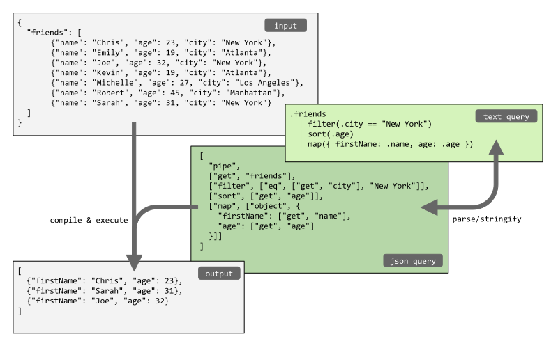

# Documentation

JSON Query is a small, flexible, and expandable query language. It comes with a human friendly [Text Format](#text-format) and an easy to parse, intermediate [JSON Format](#json-format).



## Getting started

To get started with JSON Query, select one of the [implementations](/implementations) and read the corresponding documentation on how to use the library. Typically, a JSON Query library contains a main function where the input is the data and a query, and the output is the query result:

```text
output = jsonquery(data, query)
```

Besides a query function, the library likely has functions to convert between the [JSON Format](#json-format) and [Text Format](#text-format) of JSON Query.


## Syntax

The `jsonquery` language looks quite similar to JavaScript and other JSON query languages. This makes it easy to learn. When writing a query, you compose a ["pipe"](https://medium.com/@efeminella/the-pipe-operator-a-glimpse-into-the-future-of-functional-javascript-7ebb578887a4) or a ["chain"](https://en.wikipedia.org/wiki/Method_chaining) of operations to be applied to the data. It resembles chaining like in [Lodash](https://lodash.com/docs/4.17.15#chain) or just [in JavaScript](https://medium.com/backticks-tildes/understanding-method-chaining-in-javascript-647a9004bd4f) itself using methods like `map` and `filter`.

Queries can be written in a plain [Text Format](#text-format) which is compact and easy to read for humans. The Text Format is parsed into an intermediate [JSON Format](#json-format) which is easy to operate on programmatically. This JSON Format is executed by the query engine.

The Text Format has functions, operators, property getters, pipes to execute multiple queries in series, and objects to execute multiple queries in parallel or transform the input. For example:

```text
filter(.age >= 18) | sort(.age)
```

The Text Format can be converted (back and forth) into a JSON Format consisting purely of composed function calls. A function call is described by an array containing the function name followed by its arguments, like `[name, arg1, arg2, ...]`. Here is the JSON equivalent of the previous example:

```json
[
  "pipe",
  ["filter", ["gte", ["get", "age"], 18]],
  ["sort", ["get", "age"]]
]
```

The JSON Format is mostly used under the hood. It allows for easy integrations like a GUI or executing the query in a different environment or language without having to implement a parser for the Text Format. Read more in the [JSON Format](#json-format) section.

## Text Format

The following table gives an overview of the JSON query Text Format:

| Type                    | Syntax                                                                             | Example                                                                                 |
|-------------------------|------------------------------------------------------------------------------------|-----------------------------------------------------------------------------------------|
| [Function](#functions)  | `name(argument1, argument2, ...)`                                                  | `sort(.age, "asc")`                                                                     |
| [Operator](#operators)  | `left operator right`                                                              | `filter(.age >= 18)`                                                                    |
| [Pipe](#pipes)          | <code>query1 &#124; query2 &#124; ...</code>                                       | <code>sort(.age) &#124; pick(.name, .age)</code>                                        |
| [Object](#objects)      | `{ prop1: query1, prop2: query2, ... }`                                            | `{ names: map(.name), total: sum() }`                                                   |
| [Array](#arrays)        | `[ item1, item2, ... ]`                                                            | `[ "New York", "Atlanta" ]`                                                             |
| [Property](#properties) | `.prop1`<br/>`.prop1.prop2`<br/>`."prop1"`<br/>`get("prop1", "prop2")`<br/>`get()` | `.age`<br/>`.address.city`<br/>`."first name"`<br/>`get("address", "city")`<br/>`get()` |
| [String](#values)       | `"string"`                                                                         | `"Hello world"`                                                                         |
| [Number](#values)       | A floating point number                                                            | `2.4`                                                                                   |
| [Boolean](#values)      | `true` or `false`                                                                  | `true`                                                                                  |
| [null](#values)         | `null`                                                                             | `null`                                                                                  |

The syntax is explained in detail in the following sections. The examples are based on querying the following data:

```json
[
  { "name": "Chris", "age": 23, "address": { "city": "New York" } },
  { "name": "Emily", "age": 19, "address": { "city": "Atlanta" } },
  { "name": "Joe", "age": 32, "address": { "city": "New York" } },
  { "name": "Kevin", "age": 19, "address": { "city": "Atlanta" } },
  { "name": "Michelle", "age": 27, "address": { "city": "Los Angeles" } },
  { "name": "Robert", "age": 45, "address": { "city": "Manhattan" } },
  { "name": "Sarah", "age": 31, "address": { "city": "New York" } }
]
```

### Functions

Function calls have the same syntax as in most programming languages:

```text
name(argument1, argument2, ...)
```

The following example will `sort` the data in ascending order, sorted by the property `age`.

```text
sort(.age, "asc")
```

Important to understand is that the functions are executed as a method in a chain: the sorting is applied to the data input, and forwarded to the next method in the chain (if any). The following example first filters the data, and next sorts it:

```text
filter(.age >= 21) | sort(.age, "asc")
```

See page [Function reference](/reference) for a detailed overview of all available functions and operators.

### Operators

JSON Query supports all basic operators. Operators must have both a left and right hand side. To override the default precedence, an operator can be wrapped in parentheses `(...)`. The syntax is:

```text
left operator right
```

The following example tests whether a property `age` is greater than or equal to `18`:

```text
.age >= 18
```

Operators are for example used to specify filter conditions:

```text
filter(.age >= 18)
```

When using multiple operators, they will be evaluated according to their precedence (highest first):

```text
filter(.age >= 18 and .age <= 65)
```

Note that some operators, like `and`, `or`, `+`, and `-`, support more than two values and are evaluated left-to-right, like `2 + 3 + 4`. Others, like `^` and `==`, do not support more than two values. If needed, it is always possible to use parenthesis, like `(2 ^ 3) ^ 4`.

The operators have the following precedence, from highest to lowest:

| Precedence                  | Associativity | Operators                            |
|-----------------------------|---------------|--------------------------------------|
| 8: exponentiation           | n/a           | `^`                                  |
| 7: multiplicative operators | left-to-right | `*`, `/`, `%`                        |
| 6: additive operators       | left-to-right | `+`, `-`                             |
| 5: relational operators     | n/a           | `>`, `>=`, `<`, `<=`, `in`, `not in` |
| 4: equality operators       | n/a           | `==`, `!=`                           |
| 3: and                      | left-to-right | `and`                                |
| 2: or                       | left-to-right | `or`                                 |
| 1: pipe                     | left-to-right | `\|`                                 |

See page [Function reference](/reference) for a detailed overview of all available functions and operators.

### Pipes

A _pipe_ is a series of multiple query operations separated by a pipe character `|`. The syntax is:

```text
query1 | query2 | ...
```

The entries in the pipeline are executed one by one, and the output of the first is the input for the next. The following example will first filter the items of an array that have a nested property `city` in the object `address` with the value `"New York"`, and next, sort the filtered items by the property `age`:

```text
filter(.address.city == "New York") | sort(.age)
```

### Objects

An _object_ is defined as a regular JSON object with a property name as key, and query as value. Objects can be used to transform data or to execute multiple queries in parallel.

```text
{ prop1: query1, prop2: query2, ... }
```

The following example will transform the data by mapping over the items of the array and creating a new object with properties `firstName` and `city` for every item:

```text
map({
  firstName: .name,
  city: .address.city
})
```

The following example runs multiple queries in parallel. It outputs an object with properties `names`, `count`, and `averageAge` containing the results of their query: a list with names, the total number of array items, and the average value of the properties `age` in all items:

```text
{
  names: map(.name),
  count: size(),
  averageAge: map(.age) | average()
}
```

A property can be unquoted when it only contains characters `a-z`, `A-Z`, `_` and `$`, and all but the first character can be a number `0-9`. When the property contains other characters, like spaces, it needs to be enclosed in double quotes and escaped like JSON keys:

```text
{
  "first name": map(.name)
}
```

### Arrays

Arrays are defined like JSON arrays: enclosed in square brackets, with items separated by a comma:

```text
[query1, query2, ...]
```

Arrays can for example be used for the operators `in` and `not in`:

```text
filter(.city in ["New York", "Atlanta"])
```

### Properties

An important feature is the property getter. It allows to get a property from an object or an item from an array. To get a property `age` from an object, use:

```text
.age
```

A nested property can be retrieved by specifying multiple properties. The following path for example describes the value of a nested property `city` inside an object `address`:

```text
.address.city
```

A property can be unquoted when it only contains characters `a-z`, `A-Z`, `_` and `$`, and all but the first character can be a number `0-9`. When the property contains other characters, like spaces, it needs to be enclosed in double quotes and escaped like JSON keys:

```text
."first name"
```

To get the current value itself, use the function `get` without arguments:

```text
get()
```

And, alternatively to the dot notation, the function `get` can be used for properties and nested properties too:

```text
get("age")
get("address", "city")
```

Array items can be retrieved using a property or the function `get`. For example, to get the item with index `2` from an array, use one of the following two options. Note that square bracket notation like `array[2]` is _not_ supported.

```text
get(2)
.2
```

Properties support optional chaining by default, so searching for say `.oops.city` inside an object `{"address": {"city": "New York"}}` will return `null`.


### Values

JSON Query supports the following primitive values, the same as in [JSON](https://www.json.org): `string`, `number`, `boolean`, `null`.

| Type    | Example                                                           |
|---------|-------------------------------------------------------------------|
| string  | `"Hello world"`<br/>`"Multi line text\nwith \"quoted\" contents"` |
| number  | `42`<br/>`2.74`<br/>`-1.2e3`<br/>                                 |
| boolean | `true`<br/>`false`                                                |
| null    | `null`                                                            |

## JSON Format

The Text Format described above can be converted into an intermediate JSON Format consisting purely of composed function calls and vice versa. A function call is described as a [JSON](https://www.json.org) array containing the function name followed by its arguments:

```text
[name, arg1, arg2, ...]
```

For example, the following JSON Query filters a list with objects on having a property `age > 18`, and next, sorts the objects by the property `age`.

```json
[
  "pipe",
  ["filter", ["gte", ["get", "age"], 18]],
  ["sort", ["get", "age"]]
]
```

The following table gives an overview of the Text Format and the equivalent JSON Format.

| Type     | Text Format                                  | JSON Format                                                               |
|----------|----------------------------------------------|---------------------------------------------------------------------------|
| Function | `name(argument1, argument2, ...)`            | `["name", argument1, argument2, ...]`                                     |
| Operator | `(left operator right)`                      | `["operator", left, right]`                                               |
| Pipe     | <code>query1 &#124; query2 &#124; ...</code> | `["pipe", query1, query2, ...]`                                           |
| Object   | `{ prop1: query1, prop2: query2, ... }`      | `["object", { "prop1": query1, "prop2": query2, ... }]`                   |
| Array    | `[ item1, item2, ... ]`                      | `["array", item1, item2, ... ]`                                           |
| Property | `.prop1`<br/>`.prop1.prop2`<br/>`."prop1"`   | `["get", "prop1"]`<br/>`["get", "prop1", "prop2"]`<br/>`["get", "prop1"]` |
| String   | `"string"`                                   | `"string"`                                                                |
| Number   | A floating point number                      | A floating point number                                                   |
| Boolean  | `true` or `false`                            | `true` or `false`                                                         |
| null     | `null`                                       | `null`                                                                    |

## Gotchas

The JSON Query language has some gotchas. What can be confusing at first is to understand how data is piped through the query. A traditional function call is for example `max(myValues)`, so you may expect to have to write this in JSON Query like `["max", "myValues"]`. However, JSON Query has a functional approach where we create a pipeline like: `data -> max -> result`. So, you will have to write a pipe which first gets this property and next calls the function max: `.myValues | max()`.

Another gotcha is that unlike some other query languages, you need to use the `map` function to pick some properties out of an array _for every item_ in the array. When you're just picking a few fields without renaming them, you can use the function `pick` too, which is more concise.

```
.friends | { firstName: .name, age: .age }        WRONG 
.friends | map({ firstName: .name, age: .age })   RIGHT 
.friends | pick(.name, .age)                      RIGHT 
```

## Motivation

There are many powerful query languages out there, so why the need to develop `jsonquery`? There are a couple of reasons for this.

1. **Syntax**

   Most JSON query languages have a syntax that is simple for very basic queries, but complex for more advanced queries. Their syntax is typically very compact but includes special characters and notations (like `@`, `$`, `|`, `?`, `:`, `*`, `&`), almost feeling like Regex which is infamously hard to read. The syntax is hard to remember unless you use the query language on a daily basis.

2. **Size**

   Most of the JSON query languages are quite big when looking at the bundle size. This can make them unsuitable for use in a web application where every kilobyte counts.

3. **Expressiveness**

   The expressiveness of most query languages is limited. Using for example JavaScript+Lodash to query data can be a go-to because it is so flexible. The downside however is that it is not safe to store or share queries written in JavaScript: executing arbitrary JavaScript can be a security risk.

4. **Parsable**

   When a query language is simple to parse, it is easy to write integrations and adapters for it. For example, it is possible to write a visual user interface to write queries, and the query language can be implemented in various environments (frontend, backend).

The `jsonquery` language is inspired by [JavaScript+Lodash](https://jsoneditoronline.org/indepth/query/10-best-json-query-languages/#javascript), [JSON Patch](https://jsonpatch.com/), and [MongoDB aggregates](https://www.mongodb.com/docs/manual/aggregation/). It is basically a JSON notation to describe making a series of function calls. It has no magic syntax except for the need to be familiar with JSON, making it flexible and easy to understand. The library is extremely small thanks to smartly utilizing the native language's functions and built-in JSON parser, requiring very little code to make the query language work.
